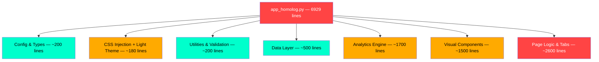

# Design Review: Family Wealth Manager (app_homolog.py)

**Review Date**: 2026-03-04  
**Route**: `/` (Single-page Streamlit app)  
**Files Reviewed**: `app_homolog.py` (6929 lines), `style.css` (1471 lines)  
**Focus Areas**: Visual Design, UX/Usability, Responsive/Mobile, Accessibility, Micro-interactions, Consistency, Performance  

## Summary

The app features a strong, distinctive **terminal/hacker aesthetic** (dark theme + emerald green #00FFCC) that creates a unique identity. The design system is well-thought-out with consistent use of JetBrains Mono for data and Inter for labels. However, there are **significant accessibility issues** (color contrast failures throughout), **mobile UX friction** (month navigation takes 3 full-width buttons), and a **massive monolithic codebase** (6929 lines in a single file) that impacts maintainability and Streamlit re-render performance. The light theme implementation via inline CSS attribute selectors is fragile and has incomplete coverage.

## Issues

| # | Issue | Criticality | Category | Location |
|---|-------|-------------|----------|----------|
| 1 | **Widespread low contrast text**: `#555` on `#000`/`#0a0a0a` yields only **2.65:1** ratio (needs 4.5:1). Affects tab labels, form labels, muted text, subtitles, and helper text throughout the entire app. ~21 violations detected by axe-core. | 🔴 Critical | Accessibility | `style.css:182-186` (`.kpi-mono-label`), `style.css:538-540` (tab color), `app_homolog.py:3448-3458` (inline `color:#555`) |
| 2 | **Form labels invisible**: Streamlit's default label color `#31333f` on `#000` background produces **1.67:1** contrast — nearly invisible. Affects all form fields (Data, Descrição, Valor, Categoria, Responsável, Tag). | 🔴 Critical | Accessibility | `style.css:507-515` (input styles override background but not label color) |
| 3 | **`maximum-scale=1.0` blocks pinch-to-zoom**: The meta viewport tag disables user scaling, violating WCAG 2.1 AA (SC 1.4.4). Users with low vision cannot zoom. | 🔴 Critical | Accessibility | `app_homolog.py:232-233` |
| 4 | **Number input step buttons missing accessible names**: The ▲/▼ stepper buttons on number inputs have no `aria-label`, making them unusable for screen readers. | 🔴 Critical | Accessibility | Streamlit built-in (mitigate with CSS `aria-label` injection or hide from a11y tree) |
| 5 | **Ultra-low contrast hint text**: `color:#333` on `#0a0a0a` background = **1.56:1** ratio. Used for tips, notes, and disclaimers. Almost invisible even for sighted users. | 🟠 High | Visual Design | `style.css:145-151` (`.autonomia-sub`), `app_homolog.py:3470-3473` (dica text), `app_homolog.py:4844` (disclaimer notes) |
| 6 | **Month navigation UX on mobile**: The ◂/▸ month navigation uses 3 separate full-width stacked buttons (prev, label, next), each taking the entire screen width. This is clunky — should be a single row with inline prev/label/next. | 🟠 High | UX/Usability | `app_homolog.py:5765-5810` (month nav columns stack vertically on mobile due to `flex-wrap: wrap`) |
| 7 | **No page landmarks/semantic structure**: All custom HTML blocks are rendered via `st.markdown(unsafe_allow_html=True)` as flat `
` structures with no ARIA landmarks (`<main>`, `<nav>`, `<section>`), making screen reader navigation impossible. | 🟠 High | Accessibility | `app_homolog.py:2971-3031` (all render_* functions) |
| 8 | **6929-line monolith**: The entire app — config, data layer, analytics engine, UI components, page logic — lives in one file. Every Streamlit interaction re-executes the full script, making cold starts slow. | 🟠 High | Performance | `app_homolog.py:1-6929` |
| 9 | **~400 lines of inline CSS for light theme**: The light theme is implemented as a massive CSS string with attribute selectors like `[style*="background:#0a0a0a"]` that match inline styles. This is extremely fragile — any style change breaks the override. | 🟠 High | Consistency | `app_homolog.py:265-407` (`_LIGHT_MODE_CSS`) |
| 10 | **Hardcoded colors in Python render functions**: Colors like `#00FFCC`, `#FF4444`, `#FFAA00`, `#0a0a0a`, `#111` are hardcoded as string literals in 100+ places in Python code instead of using CSS custom properties or a central config. Light theme can't override these. | 🟠 High | Consistency | `app_homolog.py:2977-2998` (render_autonomia), `app_homolog.py:3063-3085` (render_projection), and 50+ other locations |
| 11 | **Tabs truncated on mobile**: With 7 tabs (GASTOS, RENDA, PATRIMÔNIO, FIXOS, METAS, HISTÓRICO, CONFIG), the tab bar overflows horizontally on narrow screens. "METAS", "HISTÓRICO", and "CONFIG" may be cut off or require scrolling. | 🟠 High | Responsive | `style.css:531-559` (tab styles), `app_homolog.py:5814-5820` (7 tabs) |
| 12 | **CLS (Cumulative Layout Shift) = 0.126**: Exceeds the "good" threshold of 0.1. Caused by dynamic content injection via `st.markdown()` and late-loading Plotly charts. | 🟡 Medium | Performance | Browser metrics — affects all pages |
| 13 | **INP (Interaction to Next Paint) = 400ms**: Very high, indicating slow response to user interactions. Streamlit's full re-render model causes every click to re-execute 6929 lines of Python. | 🟡 Medium | Performance | `app_homolog.py:1-6929` (monolith re-execution) |
| 14 | **Font scale too small for readability**: Many elements use `0.48rem`–`0.6rem` (7.7px–9.6px), which is below the minimum recommended 12px for body text. Used for disclaimers, notes, sparklines, sub-labels. | 🟡 Medium | Visual Design | `style.css:119` (`.autonomia-tag: 0.65rem`), `style.css:181-186` (`.kpi-mono-label: 0.6rem`), `app_homolog.py:4844` (`0.48rem` disclaimer) |
| 15 | **No focus-visible styles for custom HTML elements**: While Streamlit handles focus for its own widgets, all custom HTML elements (KPIs, alerts, transaction cards, budget bars) have hover effects but no keyboard focus indicators. | 🟡 Medium | Accessibility | `style.css:161-165` (`.t-panel:hover`), `style.css:175-179` (`.kpi-mono:hover`) — no `:focus-visible` counterparts |
| 16 | **Inconsistent spacing system**: Spacing values are ad-hoc: `2px`, `3px`, `4px`, `6px`, `8px`, `10px`, `12px`, `14px`, `16px`, `20px`, `24px`, `28px`, `32px`, `40px`, `48px`. No consistent scale (e.g., 4/8/12/16/24/32/48). | 🟡 Medium | Visual Design | Throughout `style.css` — mix of values without a defined scale |
| 17 | **Onboarding uses emoji that may render inconsistently**: The "Primeiros Passos" section uses emoji (💰🔄⚡📊) which render differently across OS/browsers and clash with the monospace terminal aesthetic. | 🟡 Medium | Visual Design | `app_homolog.py:3437-3441` |
| 18 | **Light theme toggle via JavaScript injection**: Theme switching uses `stc.html('')` to manipulate `document.body.classList`, which is a fragile pattern that may fail on Streamlit updates or SSR. | 🟡 Medium | Consistency | `app_homolog.py:249-263` (`_apply_theme`) |
| 19 | **Autonomia hero animation always active**: The `scan-line` and `pulse-glow` animations run continuously via CSS `infinite`, consuming GPU resources even when the element is not visible. `prefers-reduced-motion` is handled but the default is heavy. | 🟡 Medium | Performance | `style.css:43-57` (`scan-line`), `style.css:59-69` (`pulse-glow`), `style.css:83-92` (`.autonomia-hero`) |
| 20 | **Cache TTL of 120s for all data**: All `@st.cache_data` calls use the same 120s TTL regardless of data volatility. Config and patrimônio rarely change (could use longer TTL), while transactions during active use need fresher data. | 🟡 Medium | Performance | `app_homolog.py:54` (`CACHE_TTL: int = 120`) |
| 21 | **No error boundary for individual components**: If any render_* function throws (e.g., bad data), the entire Streamlit app crashes. There's no try/except around individual visual components. | 🟡 Medium | UX/Usability | `app_homolog.py:2971-4400` (render functions called without error handling in main) |
| 22 | **Hover translateX on KPIs/panels shifts layout**: `.kpi-mono:hover { transform: translateX(4px) }` and `.t-panel:hover { transform: translateX(2px) }` cause content to physically shift on hover, which can be disorienting and affects adjacent elements. | ⚪ Low | Micro-interactions | `style.css:175-179`, `style.css:161-165` |
| 23 | **No skeleton/loading state**: When data is loading from Google Sheets, users see a blank page. No skeleton placeholders or loading spinners are shown during the cache miss. | ⚪ Low | UX/Usability | `app_homolog.py:5700-5750` (main function data loading) |
| 24 | **Stagger animation limited to first 5 items**: Alert items and transaction cards only have stagger delays for the first 5 children (`:nth-child(1)` through `:nth-child(5)`). Items 6+ all animate simultaneously. | ⚪ Low | Micro-interactions | `style.css:687-725` |
| 25 | **Google Fonts loaded without `font-display: swap`**: The Google Fonts URL doesn't specify `&display=swap`, which may cause FOIT (Flash of Invisible Text) on slow connections. | ⚪ Low | Performance | `app_homolog.py:237-238` |

## Criticality Legend

- 🔴 **Critical**: Breaks functionality or violates accessibility standards (WCAG AA)
- 🟠 **High**: Significantly impacts user experience or design quality
- 🟡 **Medium**: Noticeable issue that should be addressed
- ⚪ **Low**: Nice-to-have improvement

## Architecture Observation

**Recommendation**: Split into at least 4 modules: `config.py`, `data.py`, `analytics.py`, `components.py` + `app.py` (main). This would reduce cold-start overhead since Streamlit only re-executes the top-level script.

## Next Steps

### Priority 1 — Accessibility Fixes (Critical)
1. **Replace `#555` muted text with `#999`** (contrast 6.3:1 on `#000`) or `#888` (contrast 4.6:1)
2. **Add CSS override for Streamlit label colors**: `.stTextInput label p, .stNumberInput label p, .stSelectbox label p, .stDateInput label p { color: #888 !important; }`
3. **Remove `maximum-scale=1.0`** from viewport meta tag
4. **Migrate hardcoded Python colors to CSS custom properties**: Define `--color-primary: #00FFCC; --color-danger: #FF4444;` etc. in `:root` and reference in both CSS and inline styles

### Priority 2 — UX Improvements (High)
5. Fix month navigation to be a single inline row on mobile
6. Consider collapsible tab groups or a horizontal scroll for 7 tabs on mobile
7. Add `try/except` around render functions in main to prevent full-app crashes

### Priority 3 — Performance & Architecture (Medium)
8. Split the monolith into multiple Python modules
9. Add `&display=swap` to Google Fonts URL
10. Consider different `@st.cache_data` TTLs per data type
